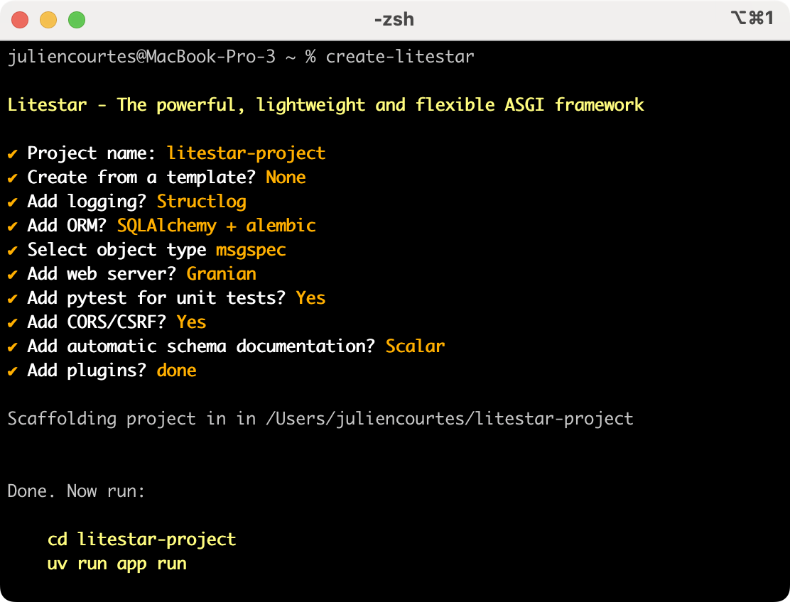

# create-litestar

Easy way to start a Litestar project

<p align="center">
  
</p>

It automatically:
- Setup project
- Add dependencies
- Add configuration
- Add .gitignore

## Templates


## Development

```bash
uv sync
uv run create-litestar
```
